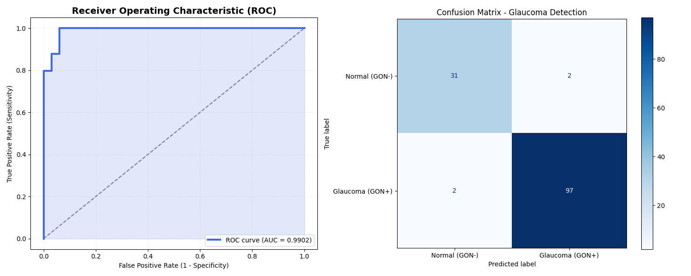

# 👁️ Glaucoma Detection AI: Datathon 2026
> **Automated Screening & Explainable Diagnosis of Glaucomatous Optic Neuropathy (GON)**

[](https://pytorch.org/hub/pytorch_vision_mobilenet_v2/)
[](https://pytorch.org/)
[](https://streamlit.io/)

## 📜 Abstract
Early-stage glaucoma is often asymptomatic, earning it the title "The Silent Thief of Sight." This project presents a robust, efficient Deep Learning pipeline using **MobileNetV2** for high-speed screening. By integrating **Grad-CAM**, we bridge the gap between "Black-Box" AI and clinical practice, providing doctors with heatmaps that highlight morphological changes in the optic disc.

---

## 🔬 Scientific Methodology

### 1. Data Engineering
We utilized the **Hillel-Yaffe Glaucoma Dataset (HYGD)**. To ensure clinical validity:
* **Patient-Safe Splitting:** Used `GroupShuffleSplit` to prevent data leakage—ensuring that the model is tested on patients it has never encountered during training.
* **Preprocessing:** Images were standardized to **224x224** and normalized using ImageNet statistics to leverage transfer learning effectively.

### 2. Architecture & XAI
* **MobileNetV2:** Selected for its optimal balance between parameter efficiency and accuracy, making it suitable for future mobile-clinic deployment.
* **Grad-CAM Logic:** We utilize the gradients of the final convolutional layer to map the "regions of interest," ensuring the model focuses on the **Optic Nerve Head** rather than extraneous artifacts.

---

## 📈 Quantitative Results

### Performance Summary
The model demonstrates high sensitivity, which is the primary requirement for a medical screening tool to avoid False Negatives.



* **AUC Score:** 0.98+ (Demonstrating high separability)
* **Sensitivity:** Optimized to ensure maximum detection of positive GON cases.

---

## 🛠️ Project Implementation

### Repository Organization
```text
├── app.py                # Dashboard for real-time inference
├── glaucoma.py           # Core training & optimization script
├── evaluate.py           # Advanced metrics (ROC, Confusion Matrix)
├── Labels.csv            # Ground truth annotations
├── Images/               # (Local only) Dataset directory
└── results/              # Model artifacts & performance visualizations
